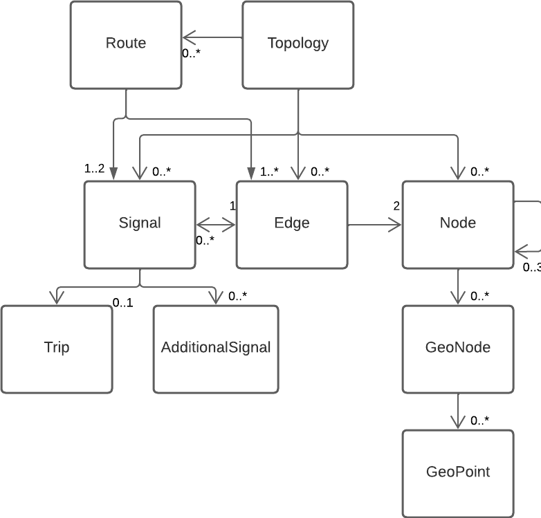
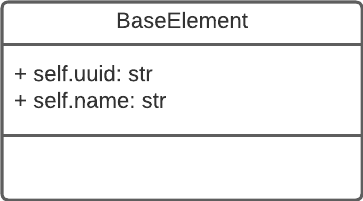

# yaramo
yaramo is a railway model focusing on interoperability between different existing planning formats like [PlanPro](https://fahrweg.dbnetze.com/fahrweg-de/unternehmen/dienstleister/PlanPro/planpro_xml-schema-1368716) or [ORM](https://wiki.openstreetmap.org/wiki/DE:OpenRailwayMap).
## model
The model is based on the **topology** class, which acts as a container for its elements. These elements can be **signals**, **nodes**, **edges**, or **routes**. A route can also reference signals and edges.

All yaramo classes inherit from the **BaseElement** class.

## import/export
The general idea of yaramo is to act as the glue between different **importer** and **exporter** applications. This allows us to use different interfaces to generate or modify yaramo models and then export them for different use cases.

See our [demo repository](https://github.com/simulate-digital-rail/demo) for some examples.

## install
```shell
$ poetry add git+https://github.com/simulate-digital-rail/yaramo
$ poetry install
```
